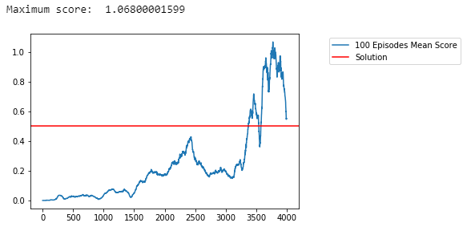

# Project III: Collaboration and Competition

## Introduction

The project uses Deep Reinforcement Learning algorithm, MADDPG, to train two agents to play Tennis game.

## Project Details

#### State-Space

The observation space consists of 8 variables corresponding to the position and velocity of the ball and racket. Each agent receives its own, local observation. Two continuous actions are available, corresponding to movement toward (or away from) the net, and jumping.

#### Rewards and Completion

In this environment, two agents control rackets to bounce a ball over a net. If an agent hits the ball over the net, it receives a reward of +0.1. If an agent lets a ball hit the ground or hits the ball out of bounds, it receives a reward of -0.01. Thus, the goal of each agent is to keep the ball in play.

The task is episodic, and in order to solve the environment, your agents must get an average score of +0.5 (over 100 consecutive episodes, after taking the maximum over both agents). Specifically,

-   After each episode, we add up the rewards that each agent received (without discounting), to get a score for each agent. This yields 2 (potentially different) scores. We then take the maximum of these 2 scores.
-   This yields a single  **score**  for each episode.

The environment is considered solved, when the average (over 100 episodes) of those  **scores**  is at least +0.5.

## Learning Algorithm
### Multi Agent Deep Deterministic Policy Gradient
The algorithm used to train the agent is DDPG which concurrently learns a Q-function and a policy. It uses the data and Bellman equations to learn the Q-function which then is used to get a proper policy to solve the problem. It is an example of actor-critic method. DDPG is wrapped by the Multi Agent Deep Deterministic Policy Gradient that allows simultaneous training of more than one agent at the same time. In this case, two agents are trained to collaborate, don't let the ball fall, and compete, gather as many points as possible.

In MADDPG, each agent's critic is trained using observations and actions from both agents. Actor is trained using just its own observations.

Classes Actor and Critic are provided in model.py file. Actor model is concerned with policy, while Critic aims to find the Q-function value which can be summarised as following:
- actor_target gets state and returns an action
- critic_target gets state and action and return a Q-value
- actor_local gets states and returns predicted actions
- critic_local gets states and actions predicted and returns actor loss (which is MSE loss)

To update the critic_local network we make the following steps:
1. Get predicted next-state actions and Q-values from the actor and critic target networks
2. Compute Q-targets for current states using Bellman equations
3. Compute Q-expected and critic loss
4. Minimise the critic loss using gradient descent methods
similarly, actor_local is updated by computing the actor's loss and then using gradient descent with backward propagation to update the weights to minimise 

### Hyperparameters and Neural Networks
The algorithm uses four neural networks for each of the agents, 8 in total:

- self.actor_local = Actor(2*self.state_size, 2*self.action_size, self.seed).to(device)
- self.actor_target = Actor(2*self.state_size, 2*self.action_size, self.seed).to(device)
- self.critic_local = Critic(2*self.state_size, 2*self.action_size, self.seed).to(device)
- self.critic_target = Critic(2*self.state_size, 2*self.action_size, self.seed).to(device)

Actor's neural network has the following structure:
- Four Fully-Connected Layers with 128 neuron units each
- Four Batch Normalisation Layers between the FC Layers
- Activations functions used are Leaky ReLU's
- Output activation layers is Tanh function
Critic has similar structure but the output acrivation layer is Leaky ReLU instead of Tanh

Modifying the network to have four Fully-Connected layers with Batch Normalisation process to normalise the output of previous layer had very positive effect on the performance and stability of the neural network which was crucial to solve the environment.

Other hyperparameters set to solve this problem are:
- BATCH_SIZE = 128, this seems to be a good value not to cause out-of-memory errors and provide stable training
- GAMMA = 0.99, typical discount factor value
- TAU = 1e-3, low value to increase the stability of the training (but also increases the time of learning, however, studies show that the stability outweights the extra time needed)
- LR_ACTOR, LR_CRITIC, learning rates for actor and critic equal to 1e-5 and 1e-4 respectively to allow relatively quick convergence and not suffer from exploding gradient for example

To increase further performance of the agents three following methods were applied:
- Ornstein-Uhlenbeck Noise: adds an exploration noise to have more consistent exploration and a richer set of behaviours
- Replay Buffer: maintans a buffer of the old experiences to use during the training process to have more efficient use of previous experiences and better convergence behaviour
- Naive Prioritized Buffer: which is used to hold information about experiences that can contribute more to the agent's learning compared to others

## Rewards and Plotting
Part of the training log looks as following:

Episode: 0, Score: 0.0, 100 Avg Score: 0.0
Episode: 100, Score: 0.0, 100 Avg Score: 0.0010000000149011613
Episode: 200, Score: 0.0, 100 Avg Score: 0.005900000091642142
Episode: 300, Score: 0.0, 100 Avg Score: 0.0331000005453825
Episode: 400, Score: 0.0, 100 Avg Score: 0.013600000217556953
Episode: 500, Score: 0.10000000149011612, 100 Avg Score: 0.027300000451505185
Episode: 600, Score: 0.0, 100 Avg Score: 0.03010000051930547
...
Episode: 3100, Score: 0.10000000149011612, 100 Avg Score: 0.15650000235065817
Episode: 3200, Score: 0.10000000149011612, 100 Avg Score: 0.2404000036045909
Episode: 3300, Score: 0.4000000059604645, 100 Avg Score: 0.2573000038601458
Solved! Episode: 3371, Consecutive 100 Episodes Average: 0.5010000075213611
Solved! Episode: 3373, Consecutive 100 Episodes Average: 0.504900007583201
Solved! Episode: 3374, Consecutive 100 Episodes Average: 0.5109000076726079
Solved! Episode: 3375, Consecutive 100 Episodes Average: 0.5139000077173114
...
Solved! Episode: 3749, Consecutive 100 Episodes Average: 1.0098000151291489
Solved! Episode: 3750, Consecutive 100 Episodes Average: 1.0098000151291489
Solved! Episode: 3751, Consecutive 100 Episodes Average: 1.0059000150673092
...
Solved! Episode: 3997, Consecutive 100 Episodes Average: 0.5537000083737076
Solved! Episode: 3998, Consecutive 100 Episodes Average: 0.5487000082992017
Solved! Episode: 3999, Consecutive 100 Episodes Average: 0.550700008329004

As the graph shows, the training is very unstable and unpredictable. There is lots of 'ups' and 'downs' throughout the 4000 episodes. The breakthrough happened around 3300 episode where the score got rapidly higher and solved the environment. 

The agents needed 3371 episodes to achieve an average above or equal to +0.5 score in 100 consecutive episodes which solves the environment. On 3748 episode, the score achieved was +1.0, doubling of the score needed to consider the problem as solved.

## Future Work Ideas
The performance could be improved in many ways, some of them are:
- adding more layers to the neural network for better approximation and include different normalisation techniques like L1, L2 normalization which are proven to increase the performance of networks and provide better accuracy with faster convergence
- spend more time on playing with different hyperparameters to see the correlation between them and the agent's performance
- implementing different algorithms instead of DDPG, like MAPPO, Memory Augmented Policy Optimization, which may have better performance in this particular problem